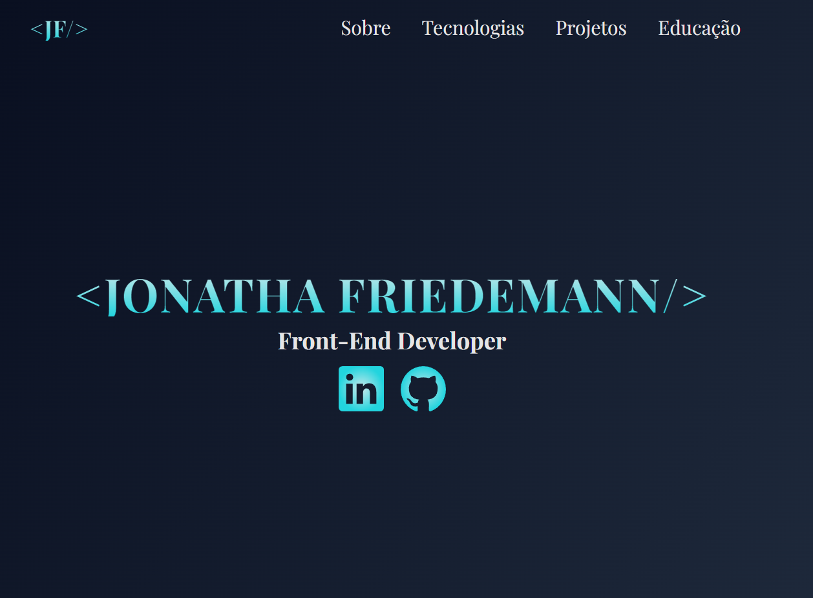

# Portfolio

Portfólio pessoal

## Objetivo

Esse projeto tem como objetivo demonstrar minhas habilidades e servir como um currículo online. Além de registrar meu progresso e evolução.

### Tecnologias utilizadas:

 
 
  
  
